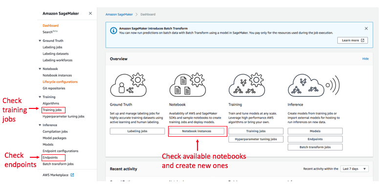
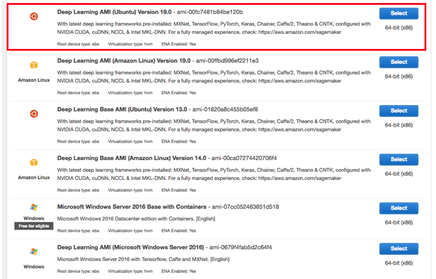
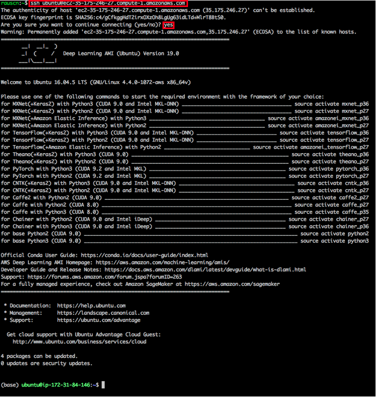
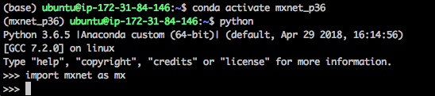

# Run on AWS
This tutorial will guide you through the different AWS services that allow doing Machine Learning at large scale in the quickest and easiest way possible. User who only need compute instances should follow chapter [Run on an EC2 instance](https://github.com/NRauschmayr/gluon-crash-course/blob/run-on-aws-updated/use_aws.md#run-on-an-ec2-instance). EC2 provides specialized Deep Learning images so developers can start training their models right away without the hassle of installing driver and software frameworks. 

Deep Learning projects usually consist of a set of problem tasks: for instance you may have to create training datasets, train and evaulate your model, tune its hyperparameters and finally deploy the model to a production ready cluster. This workflow can be quite cumbersome and time consuming. For this reason AWS provides Amazon SageMaker a fully managed machine learning service that accelerates the overall Deep Learning workflow (see chapter [Run on Amazon Sagemaker](https://github.com/NRauschmayr/gluon-crash-course/blob/run-on-aws-updated/use_aws.md#run-on-amazon-sagemaker)).

## Run on Amazon SageMaker
This chapter will give a high level overview about Amazon SageMaker, in-depth tutorials can be found on the [Sagemaker website](https://docs.aws.amazon.com/sagemaker/latest/dg/whatis.html) and [here](https://medium.com/apache-mxnet/getting-started-with-sagemaker-ebe1277484c9).



SageMaker offers Jupyter notebooks and supports all major Deep Learning frameworks out-of-the box. Within this notebook you can [fetch, explore and prepare training data](https://docs.aws.amazon.com/sagemaker/latest/dg/how-it-works-notebooks-instances.html). 
```
import mxnet as mx
import sagemaker
mx.test_utils.get_cifar10() # Downloads Cifar-10 dataset to ./data
sagemaker_session = sagemaker.Session()
inputs = sagemaker_session.upload_data(path='data/cifar',
                                       key_prefix='data/cifar10')
```
Once the data is ready, you can easily launch training via the SageMaker SDK. So there is no need to manually configure and log into EC2 instances. You can either bring your own model or use SageMaker's [built-in algorithms](https://docs.aws.amazon.com/sagemaker/latest/dg/algos.html) that are tailored to specific use cases such as computer vision, NLP etc. SageMaker encapsulates the process of training into the class ```Estimator``` and we can now start the training on a p3.2xlarge instance:
```
from sagemaker.mxnet import MXNet as MXNetEstimator
estimator = MXNetEstimator(entry_point='train.py', 
                           role=sagemaker.get_execution_role(),
                           train_instance_count=1, 
                           train_instance_type='ml.p3.2xlarge',
                           hyperparameters={'batch_size': 1024, 
                                            'epochs': 30})
estimator.fit(inputs)
```
You need to provide a training script that must follow a certain format. When the model is ready for deployment you can use [SageMaker's hosting services](https://docs.aws.amazon.com/sagemaker/latest/dg/how-it-works-hosting.html) that create an HTTPS endpoint where model inference is provided.
```
predictor = estimator.deploy(initial_instance_count=1,
                             instance_type='ml.m4.xlarge')
```

The following links show more advanced uses cases in SageMaker:
  - [Distributed training on multiple machines](https://medium.com/apache-mxnet/94-accuracy-on-cifar-10-in-10-minutes-with-amazon-sagemaker-754e441d01d7) 
  - [Hyperparameter Tuning Jobs](https://docs.aws.amazon.com/sagemaker/latest/dg/automatic-model-tuning-ex.html)
  - [Optimize a model with SageMaker Neo](https://docs.aws.amazon.com/sagemaker/latest/dg/neo.html)
  - [Build Groundtruth Datasets](https://docs.aws.amazon.com/sagemaker/latest/dg/sms-getting-started.html)
  
  
  


## Run on an EC2 instance 
This chapter shows, how to allocate a CPU/GPU instance in AWS and how to setup the Deep Learning environment.

We first need [an AWS account](https://aws.amazon.com/), and then go the EC2 console
after login in.


[Optional] You can select a region on the right upper corner that is close to
your location to reduce the network latency. But also note that some regions may
not have GPUs instances.

Then click "launch instance" to select the operation system and instance type.


AWS offers [Deep Learning AMIs](https://docs.aws.amazon.com/dlami/latest/devguide/options.html) 
that come with the latest versions of Deep Learning frameworks. The Deep Learning AMIs provide 
all necessary packages and drivers and allow you to directly start implementing 
and training your models. Deep Learning AMIs use optimized binaries, which accelerate model training and inference.
AWS also offers DL Base AMIs that are useful for users that need their own custom Deep Learning environment. In this tutorial we use Deep Learning AMI (Ubuntu) Version 19.0:   





We choose "p2.xlarge", which contains a single Nvidia K80 GPU. Note that there is a
large number of instance, refer to
[ec2instances.info](http://www.ec2instances.info/) for detailed configurations
and fees.


Note that we need to check the instance limits to guarantee that we can request
the resource. If running out of limits, we can request more capacity by clicking
the right link, which often takes about a single workday to process.


On the next step we increased the disk from 8 GB to 40 GB so we have enough
space store a reasonable size dataset. For large-scale
datasets, we can "add new volume". Also you selected a very powerful GPU
instance such as "p3.8xlarge", make sure you selected "Provisioned IOPS" in the
volume type for better I/O performance.


Then we launched with other options as the default values. The last step before
launching is choosing the ssh key, you may need to generate and store a key if
you don't have one before.


After clicked "launch instances", we can check the status by clicking the
instance ID link.


Once the status is green, we can right-click and select "connect" to get the access instruction.


With the given address, we can log into our instance:



The login screen will show a long list of available conda environments for the different Deep Learning frameworks, CUDA driver and Python versions. With ```conda activate``` you can easily switch into the different environments. In the following example we switch to the MXNet Python 3.6 environment:

 

Now you are ready to start developing and training MXNet models. Once you start training, you can check the GPU status with ```nividia-smi```.
